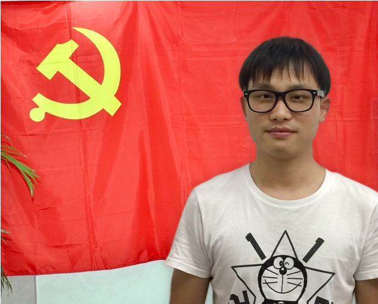

<div width="100%" style="text-align:center;"><h1>不忘初心 牢记使命</h1></div>

<br/>

* **我是谁?**

[](introduce.mp4)

<br/>

* **我敬畏党旗**




<br/>

* <strong>我的故事</strong>

```
    1.为什么要加入中国共产党?

    我是一名普通农村小孩,长辈中只有外公是一名先进的共产党员.小时候总是在外公小小窄门看到"优秀共产党员"的小铁牌.人慢慢长大从书中领悟到"人活着总要有信仰，否则便如行尸走肉"我便从小小窄门的崇拜理解到了我自身的信仰,我一定要加入中国共产党.

    2. 入党心情

    入预备党员宣誓的前一个晚上一夜没睡好,心中老是不停的问自己"我能做到吗?我能做到吗?明天我得演讲能顺利吗?",那一刻开始真正感觉到入党的沉重,入党决不是一件草率的事.第二天直到上台前我都是手心冒汗,听不懂身边人的"谈笑风生",心中念叨要上台了马上要上台了,当广播里叫到我的名字时我又突然释然了.
    ...
    时间匆匆而一年飞逝我依然又站到了那个熟悉的舞台,铿锵有力的宣读入党誓词，心情是异常激动和兴奋的,已过渡了那段紧张的预备期.因为那时候我已经坚信自己是一名优秀的共产党员.
```


<br/>

* <strong>我的感言</strong>

```
    2016年7月1日是我的政治生日今年已经两周岁了.
```
入党为什么?
```
    一我入党目的就是为了干事业，实现自身的人生价值.我出身农村，但却充满着干事创业的热情和冲动，加入共产党后，我和其他党员一样有了共产党人的崇高理想，那就是“为实现共产主义而奋斗终身”。千里之行，始于足下。多年来，我始终坚持今天的努力与远大的理想相结合，凭着忠诚为党的伟大事业而奋斗。
    二是练就一颗做公仆的心，全心全意为人民服务。利为民所谋，权为民所用。
    三是为了当表率，发挥先锋模范作用。共产党是中国工人阶级的先锋队，加入先锋队的一员，就应该处处做表率。端正入党动机，则是新形势下保持共产党员先进性的前提条件和坚实基础。
```

 在党干什么?
```
    在党干为人民服务的事。入党后，我始终提醒自己，我是一名共产党员，就应该以党的事业为重，吃苦在前、享受在后，多吃苦，多做事、多奉献、少索取。工作任务再重，也应做到不推诿，总是想尽办法去完成。作为一名合格的共产党员，首先，我们应确保不给党抹黑，立足本职，在平凡的岗位上做出不平凡的业绩，让老百姓都说党员好、共产党好。其次，我们应做到：权为民所用，情为民所系，利为民所谋。清楚认识到，老百姓是天，老百姓是地，我们应全心全意为百姓服务。

```
在党干什么?

```
    要留下共产党员的崇高形象;要留下共产党员的英勇气概;要留下共产党员的高尚品格;要留下共产党员的可贵精神。在今后的工作中，做到：从我做起，总现在做起，从身边的小事、从点滴做起，树立正确的人生观、世界观、价值观，并牢记中国共产党全心全意为人民服务的宗旨，永远保持共产党的优良传统，做一名合格的共产党员。要脚踏实地，踏实的走好人生路，体现党的求真务实之风。
```
```
    "不忘初心,牢记使命"这是我们这一代年轻人的使命!
    "栉风沐雨,砥砺前行"为实现中华名族伟大的复兴梦不懈努力!
```


<br/>

<div style="text-align:right">
    <table width="100%">
        <tr>
            <td width="80%" style="text-align:right;">投稿人:</td>
            <td style="text-align:left;">邓祖洪</td>
        </tr>
        <tr>
            <td style="text-align:right;">投稿时间:</td>
            <td style="text-align:left;">2018-06-20</td>
        </tr>
    </table>
</div>
